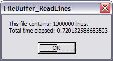



## FileBuffer Count Lines, Words, Strings in Files \(super fast\!\)

### Description

In rare situations, there are times where you may need to know how many line-breaks a file contains "before hand". The situation for me was that I wanted to let the user of my program know what percentage of a file was being read (had to be line by line) and inorder to do this, I had to know how many lines a file contained.

Now, this is meant for HUGE lists of files. Examples are, email lists, number lists, contact lists, etc. This code will read 1,000,000 lines of a file per second (my machine is 2.6 Ghz, p4, 512MB ram). This is VERY fast. I included a benchmarking class so you can see it for yourself. I also included a zipped file which contains one million lines (16MB unzipped, 40KB zipped) and a file containing one hundred thousand lines of text as well.

NOTE: This isn't just for counting lines in a file, it can be used to count how many occurances a string comes up, such as a First Name, a Last Name, a phone number, a word, etc. The whole point of this program is to buffer a file into memory as fast as the hard drive can go (1MB buffer by default) and then read off that buffered data as it comes in.

The OLD/Popular method for counting lines:

Dim lLineCount as long, strLine as string * 1

Open "C:\file.txt" for input as #1

Do While not eof(1)

Line Input #1, strLine

lLineCount = lLineCount + 1

Loop

MsgBox lLineCount &amp; " Lines Read."
 
### More Info
 
A file

how many lines or strings were found.

             |
---                |---
**Submitted On**   |2006-05-11 04:31:06
**By**             |[Michael L\. Canejo](https://github.com/Planet-Source-Code/PSCIndex/blob/master/ByAuthor/michael-l-canejo.md)
**Level**          |Intermediate
**User Rating**    |4.5 (18 globes from 4 users)
**Compatibility**  |VB 4\.0 \(16\-bit\), VB 4\.0 \(32\-bit\), VB 5\.0, VB 6\.0, VB Script
**Category**       |[Files/ File Controls/ Input/ Output](https://github.com/Planet-Source-Code/PSCIndex/blob/master/ByCategory/files-file-controls-input-output__1-3.md)
**World**          |[Visual Basic](https://github.com/Planet-Source-Code/PSCIndex/blob/master/ByWorld/visual-basic.md)
**Archive File**   |[FileBuffer1993235112006\.zip](https://github.com/Planet-Source-Code/michael-l-canejo-filebuffer-count-lines-words-strings-in-files-super-fast__1-65292/archive/master.zip)

